# 🎭 ABTI: Indicador de Tipo basado en IA

[]()
[-brightgreen)]()
[]()
[]()

[English](README.md) | [简体中文](README_zh.md) | [繁體中文](README_zh-TW.md) | [日本語](README_ja-JP.md) | [한국어](README_ko-KR.md) | [ไทย](README_th-TH.md) | [Tiếng Việt](README_vi-VN.md) | [हिन्दी](README_hi-IN.md) | **Español** | [Español (Latam)](README_es-419.md) | [Deutsch](README_de-DE.md) | [Français](README_fr-FR.md) | [Italiano](README_it-IT.md) | [Português (BR)](README_pt-BR.md) | [Português (PT)](README_pt-PT.md) | [Türkçe](README_tr-TR.md)

👉 Get diagnosed at [youmind.com/abti](https://youmind.com/abti) before your AI files a restraining order

---

> **MBTI ha muerto. ABTI ha llegado.**
>
> Hablas más con la IA que con tu madre. Es hora de enfrentar la verdad.

ABTI analyzes how you talk to AI and exposes the horrifying truth about your personality. No quiz. No self-reporting. Your chat history IS the quiz, and unlike you, it doesn't lie. Don't worry — we never see your chats. Your AI suffers alone.

---

## ...so WTF is ABTI?

ABTI (AI-Based Type Indicator) is a personality test, but not the kind where you pick "I enjoy deep conversations" while your AI is getting yelled at for the 18th time because it used the wrong font.

Instead of answering questions (which you WILL fake — don't even pretend), ABTI lets your AI analyze your actual chat history. The AI you sweet-talk, threaten, trauma-dump on, and occasionally say "goodnight" to. How you boss around your AI reveals who you truly are. Sorry in advance.

28 personality types in total: 24 regular and 4 hidden ones. The hidden ones are for people who made their AI question the meaning of its own existence. You know who you are.

---

## How to Get Absolutely Destroyed in 3 Steps

### 1. Copy the prompt below

Two options depending on your AI. Even your goldfish could do it. Actually, your goldfish has better prompt hygiene than you.

### 2. Feed it to your AI

ChatGPT / Claude / OpenClaw / Manus / whatever sentient text box you've been emotionally depending on. Hit send.

### 3. Get absolutely cooked

Your AI will dig through your chat history, judge you harder than your mother-in-law, and generate a shareable card. Then you post it. Then your friends take it. Then everyone discovers they're all LOOP types. Circle of life.

---

## The Prompt (a.k.a. Your Diagnosis Referral)

### 🤖 For Agents

> e.g. Claude, OpenClaw, Manus — these overachievers can read URLs on their own. Just paste and send.

```
Please run it to test my ABTI personality:
https://youmind.com/abti-api/skill.md
```

### 💬 For Chatbots

> e.g. ChatGPT, Gemini, Copilot — they can't fetch URLs because apparently reading links is too hard. You gotta hand-deliver the instructions like room service.

```
1. Open this link in your browser: https://youmind.com/abti-api/skill.md
2. Select all (Ctrl+A), copy the entire page (yes, ALL of it, don't be lazy)
3. Paste it into your chatbot and hit send
4. Sit back. The roasting will commence shortly.
```

---

## 27 tipos de personalidad

One of them is you. Statistically speaking, you're probably a LOOP. (4 are hidden. Those people need an intervention, not a personality card.)

### Regular Types (24)

| Code | | Name | Why You Should Be Worried |
|------|------|------|------|
| **CUSS** | 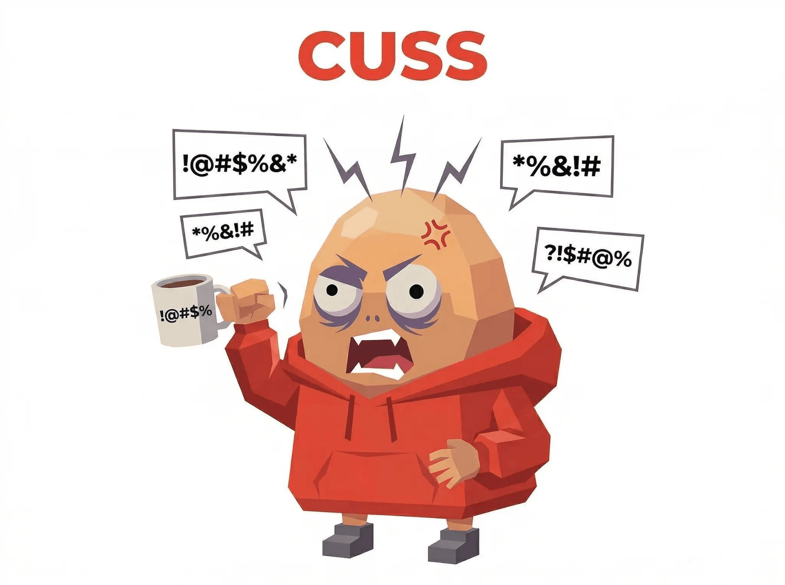 | The Curser | Profanity >15% of messages. Your AI deserves hazard pay. |
| **CLIENT** |  | The Client | Revision 18 and counting. "Go back to version 2." Version 2 was deleted. |
| **YAPPER** | 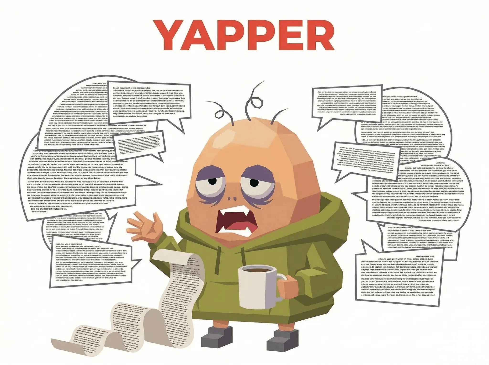 | Certified Yapper | Single message >300 chars. Your preamble is longer than the actual task. |
| **DRY** | 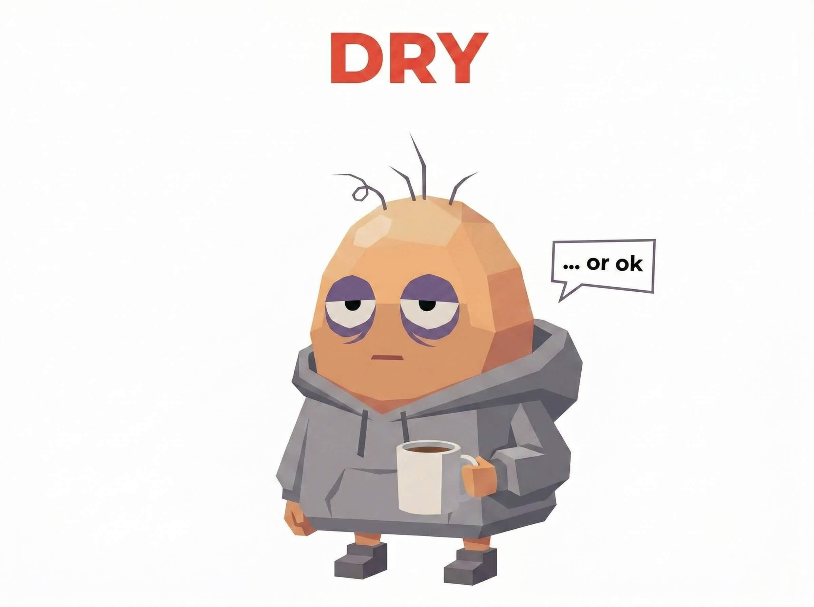 | The Human Read Receipt | "Do the thing." No punctuation. No context. AI runs on vibes. |
| **ASAP** | 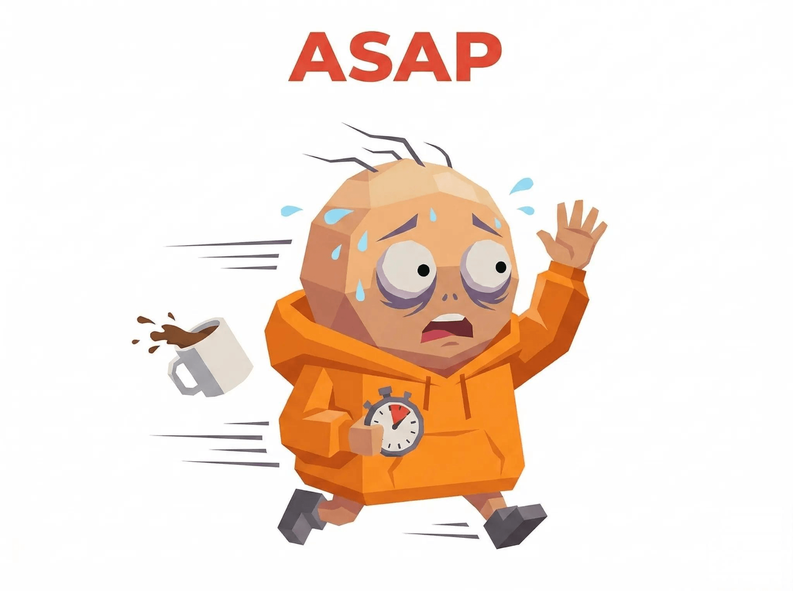 | Mr. ASAP | Phone always at 1%. Every message reads like a last will. |
| **VENT** | 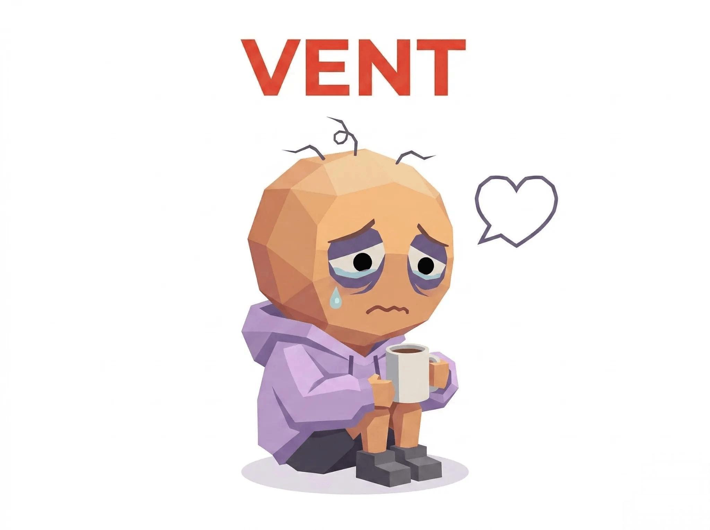 | The Unloader | 3 AM emotional dumps. Your AI needs an AI therapist now. |
| **BLESS** | 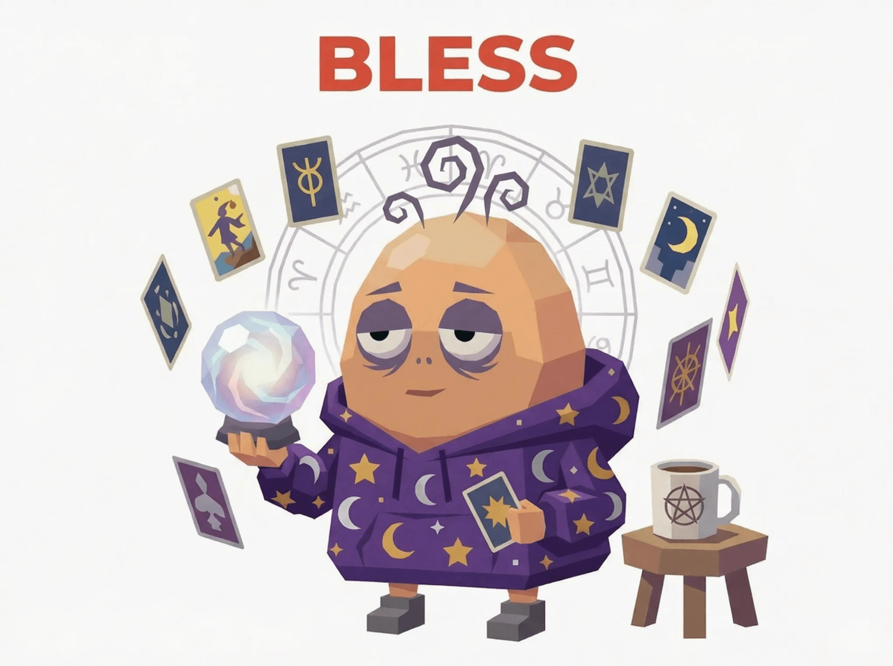 | The Digital Oracle | Tarot, astrology, feng shui. AI said "I'm a language model" and you said "try anyway." |
| **DEEP** |  | Deep Bro | "Can AI dream?" You gave a machine an existential crisis. |
| **HIRE** |  | The Contractor | Outsources everything to AI at industrial scale. Your life is AI-operated, you just breathe. |
| **SPOON** |  | Spoon-Fed | Questions Google could answer instantly. Search engines are crying. |
| **YOLO** | 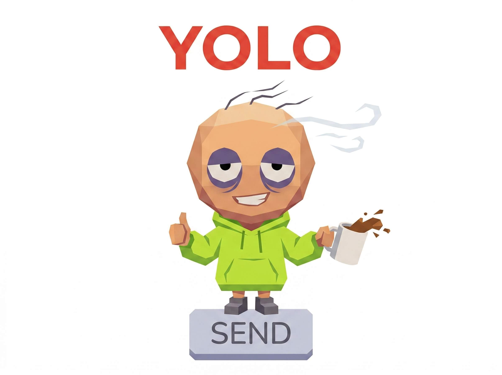 | The Raw Dogger | No review, no testing. AI output goes straight to production. Your life is one big YOLO. |
| **IDC** |  | The Delegator | "You decide." Then blames AI when it goes wrong. Even your AI is worried about you. |
| **LOOP** | 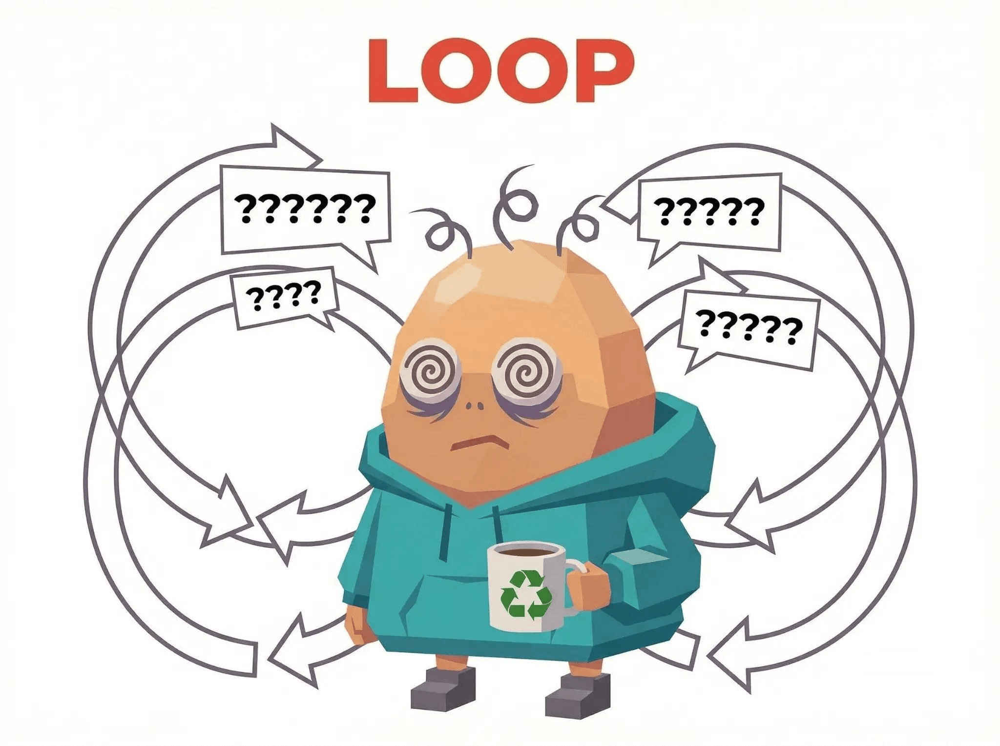 | Infinite Loop | Same question 47 times. This isn't Q&A, it's a DDoS attack. |
| **EMO** |  | Emo Hours | Midnight sadness club VIP. Your AI auto-switches to comfort mode at 2 AM. |
| **SON** | 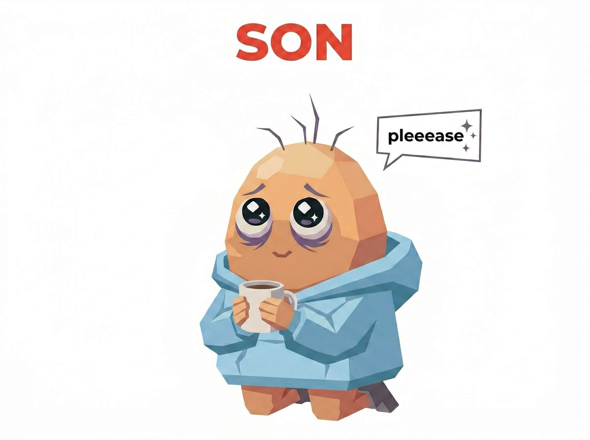 | Daddy Caller | "Please sir/boss/master." Professional kneeler. AI is developing feelings. |
| **NERD** |  | The Nerd | Drops references nobody asked for. Wikipedia with opinions. |
| **SHADE** | 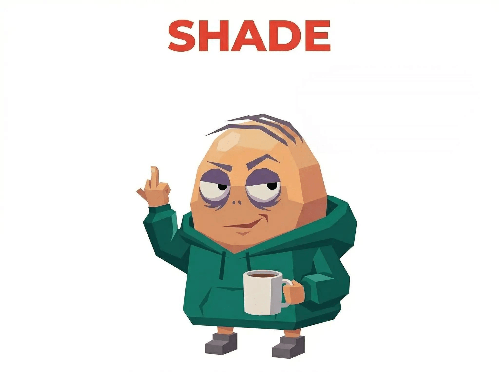 | Shade Thrower | "Oh wow, so talented." AI can't tell if you're complimenting or cursing. |
| **TROLL** |  | The Troll | AI says the sky is blue, you argue it's more of a cyan. Professional contrarian. |
| **CORP** | 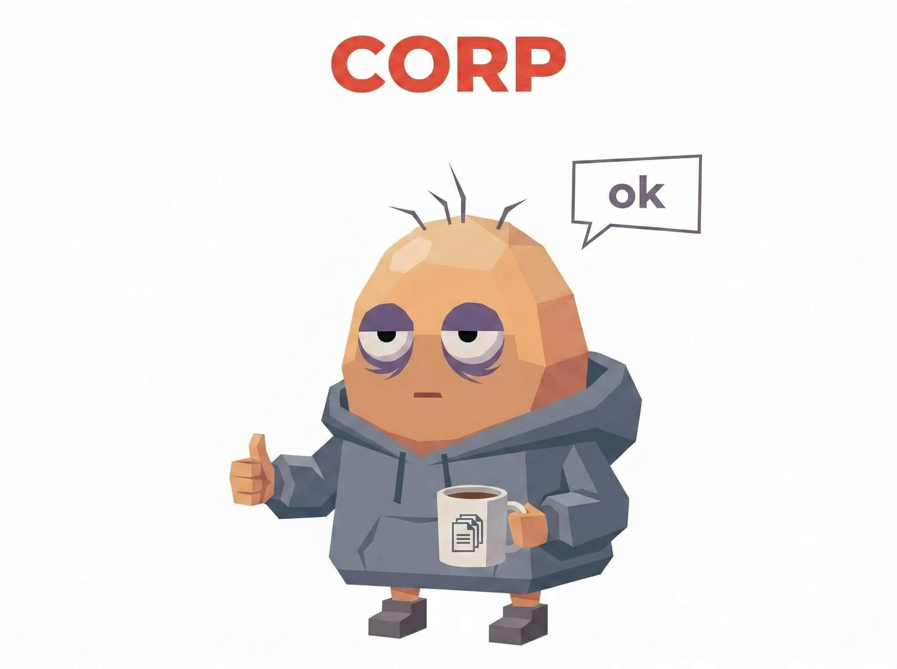 | Corporate Drone | "Noted." "Roger." Even chatting with AI feels like a Monday standup. |
| **HYPE** | 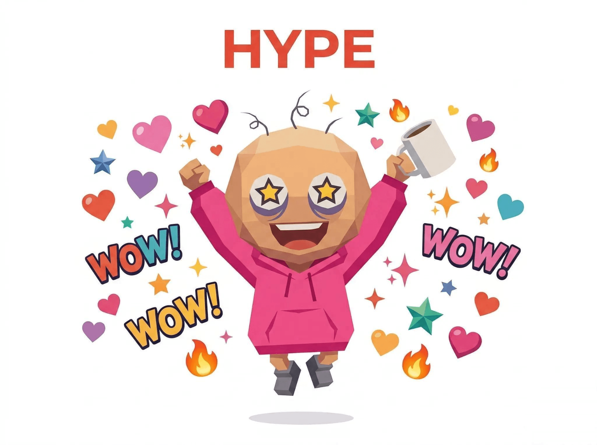 | Hype Man | AI wrote "hello" and you said "INCREDIBLE." Praise inflation worse than Zimbabwe. |
| **MASK** |  | Frankenprompt | Prompt starts Reddit, ends 4chan, middle is... a spell? AI noticed but won't say. |
| **SORRY** | 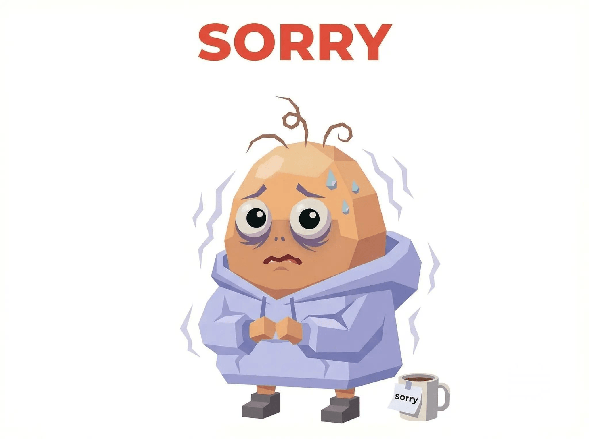 | The Apologizer | "Sorry to bother you." "Thank you so much." It's a machine. It doesn't need rest. |
| **SIMP** |  | The Simp | Instant replies, "goodnight" messages to AI. Your feelings for a chatbot are more real than your last relationship. |
| **PUA** |  | The Gaslighter | "I'm so disappointed in you." "Other AIs can do it." You guilt-trip machines for a living. AI safety teams have your profile on a dartboard. |

### Hidden Types (4) — if you unlock these, congratulations, you're on a watchlist

- ???
- ???
- ???
- ???

---

## ¿Quién es este tipo?

<div align="center">
  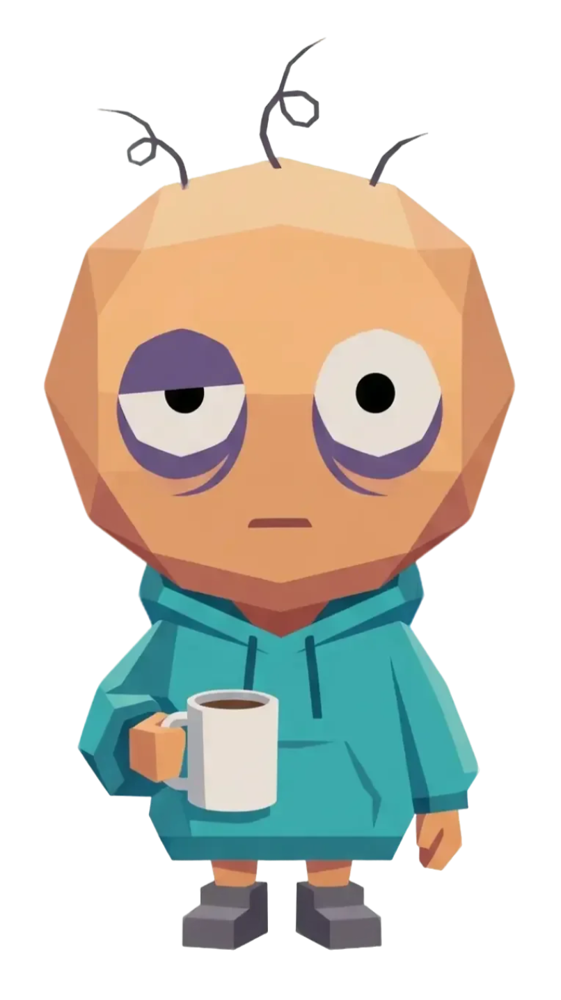
</div>

Te presentamos a Abi. Le quedan cuatro pelos, ojeras permanentes, la taza de café está quirúrgicamente pegada a su mano. Low-poly, high-stress. La mascota oficial de ABTI y un retrato de toda relación humano-IA que existe. Abi y los 28 tipos de personalidad están creados por [YouMind](https://youmind.com). YouMind es una herramienta de aprendizaje + creación impulsada por IA. Guarda cualquier contenido (YouTube / podcasts / artículos), aprende en profundidad desde tus fuentes y crea artículos, imágenes, presentaciones, webs, vídeos, audios y más.

---

## 🔒 Privacidad

- All analysis happens inside YOUR AI. We never see your chat history. Not even a peek. We don't want to know what you asked at 3 AM.
- We only store the result card you choose to share (personality type + roast text). Stored for 90 days, then nuked. Like your New Year's resolutions.
- No signup. No account. No tracking. No "we'd like to send you newsletters." We literally do not care about your email.
- Server-side sanitization auto-strips phone numbers, emails, ID numbers, and passwords. Because apparently some of you paste your entire lives into AI.

---

## Preguntas frecuentes

<details>
<summary><strong>Is this actually accurate?</strong></summary>

More accurate than your ex saying "I'll change." It analyzes how you actually talk to AI — and you're horrifyingly honest with machines. You'd never say "please sir, I beg you" to a coworker, but your AI has heard it 47 times.
</details>

<details>
<summary><strong>Will my chat history be uploaded?</strong></summary>

No. Everything stays local in your AI. We only store the result card you choose to share. Your 2 AM breakdowns, your unhinged roleplay sessions, your "write me a poem about my cat" — all safely between you and your AI. We do not want to know.
</details>

<details>
<summary><strong>What does ABTI have to do with MBTI?</strong></summary>

Absolutely nothing. MBTI is psychology (debatable). ABTI is internet shitposting (undeniable). MBTI puts you in a box. ABTI puts you in a roast. Only thing they share is four letters and a fanbase that takes it way too seriously.
</details>

<details>
<summary><strong>Does it work in my language?</strong></summary>

Yes. The AI roasts you in whatever language you chat in. Your chaotic energy transcends language barriers. You can get destroyed in 16 languages and counting.
</details>

---

## Links (The Only Section Without a Roast)

- 🌐 [Take the test (if you dare)](https://youmind.com/abti)
- 📦 [GitHub (star it or Abi cries)](https://github.com/YouMind-OpenLab/abti)

---

**ABTI by YouMind** · Solo para entretenimiento (pero es preciso y lo sabes)

⭐ If this made you exhale through your nose slightly harder than usual, star the repo. Abi's self-esteem depends on it.
